# Photo Hosting

Веб-приложение для хранения и управления фотографиями с поддержкой альбомов, избранного и возможностью делиться снимками.

## Описание

Photo Hosting - это fullstack приложение для хранения фотографий, которое предоставляет пользователям возможность:

- Регистрироваться и авторизовываться в системе
- Загружать фотографии с возможностью обрезки
- Создавать и управлять альбомами
- Добавлять фотографии в избранное
- Просматривать фотографии в галерее
- Делиться фотографиями с другими пользователями

## Технологический стек

### Frontend
- React 19
- TypeScript
- React Router
- Axios
- Vite
- Custom UI Library

### Backend
- Node.js + Express
- TypeScript
- SQLite (better-sqlite3)
- JWT для аутентификации
- Multer для загрузки файлов
- Sharp для обработки изображений

## Структура проекта

```
photo-hosting/
├── frontend/          # React приложение
├── backend/           # Express API сервер
└── ui/               # Библиотека UI компонентов
```

## Требования

- Node.js >= 18.x
- npm или yarn

## Установка и запуск

### 1. Установка зависимостей

#### UI библиотека
```bash
cd ui
npm install
npm run build
```

#### Backend
```bash
cd backend
npm install
```

#### Frontend
```bash
cd frontend
npm install
```

### 2. Конфигурация

Создайте файл `.env` в папке `backend` с необходимыми переменными окружения:

```env
PORT=3001
JWT_SECRET=your_secret_key_here
UPLOAD_DIR=./uploads
DB_PATH=./database.db
```

### 3. Запуск приложения

#### Режим разработки

Запустите backend:
```bash
cd backend
npm run dev
```

Запустите frontend (в отдельном терминале):
```bash
cd frontend
npm run dev
```

Приложение будет доступно по адресу `http://localhost:5173`

API сервер работает на `http://localhost:3001`

#### Production режим

Backend:
```bash
cd backend
npm run build
npm start
```

Frontend:
```bash
cd frontend
npm run build
npm run preview
```

## Доступные скрипты

### Frontend
- `npm run dev` - запуск dev сервера
- `npm run build` - сборка для production
- `npm run lint` - проверка кода
- `npm run test` - запуск тестов

### Backend
- `npm run dev` - запуск в режиме разработки с hot reload
- `npm run build` - компиляция TypeScript
- `npm start` - запуск production сборки
- `npm run lint` - проверка кода

## Основные функции

### Аутентификация
- Регистрация новых пользователей
- Вход в систему с использованием JWT токенов
- Защищенные маршруты

### Управление фотографиями
- Загрузка фотографий с предварительной обрезкой
- Просмотр фотографий в галерее
- Детальный просмотр фотографий
- Удаление фотографий

### Альбомы
- Создание альбомов
- Добавление фотографий в альбомы
- Просмотр альбомов
- Управление альбомами

### Избранное
- Добавление фотографий в избранное
- Просмотр избранных фотографий

### Шеринг
- Возможность делиться фотографиями с другими пользователями

### Cтраницы:
/ (главная)


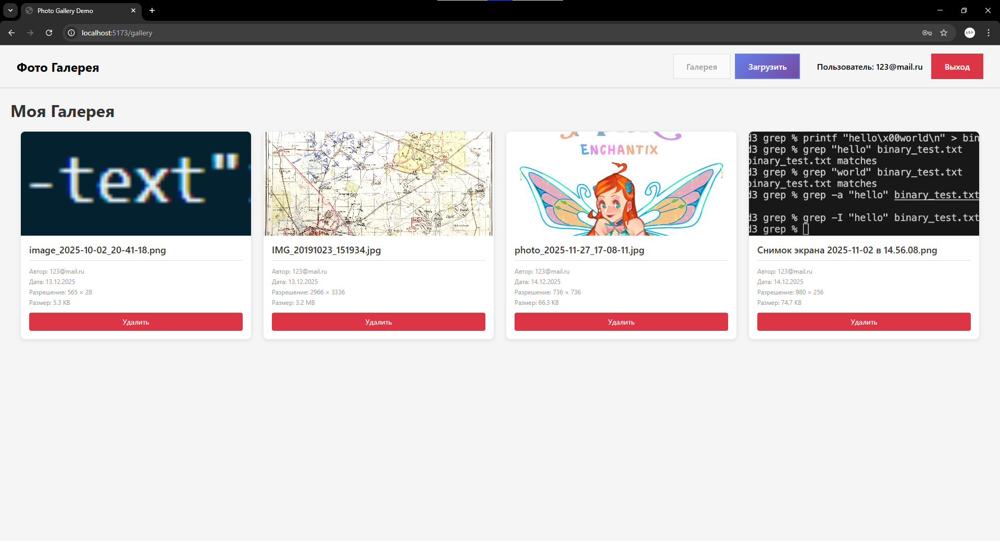

/gallery
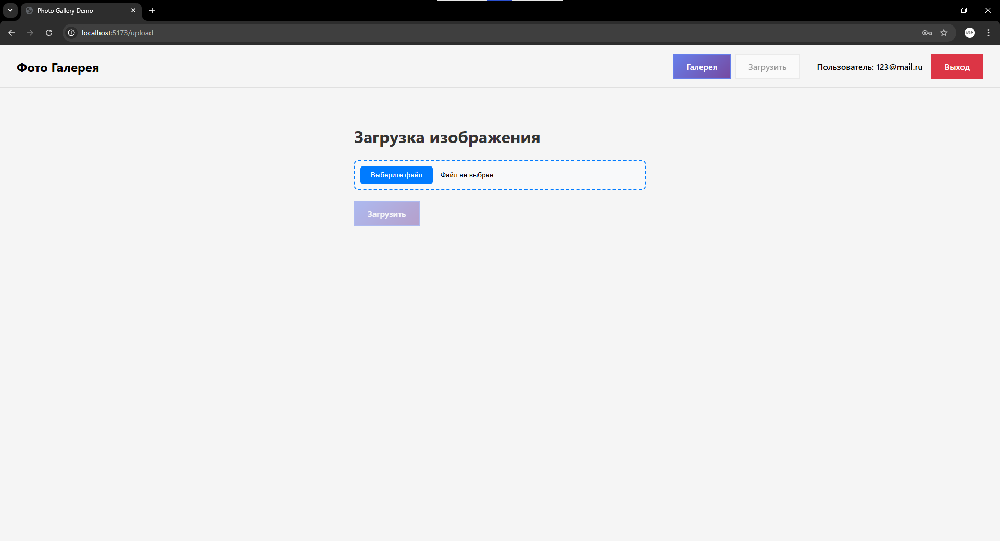

/upload
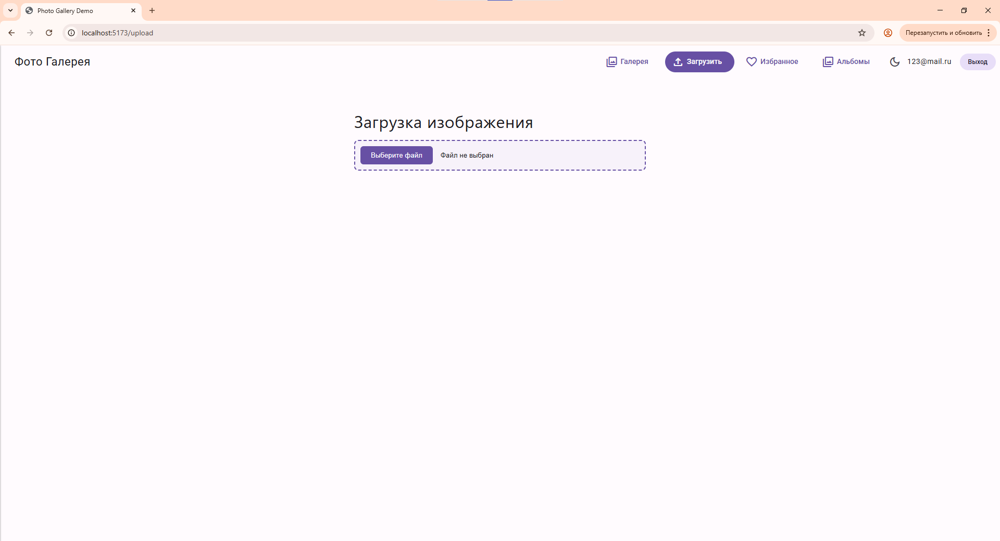
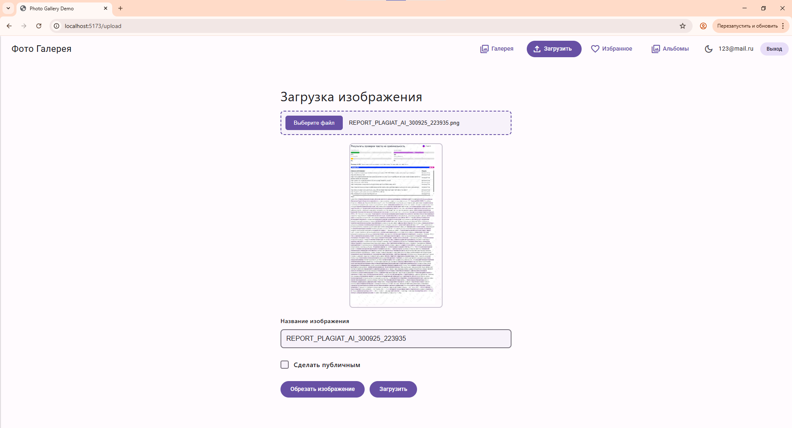
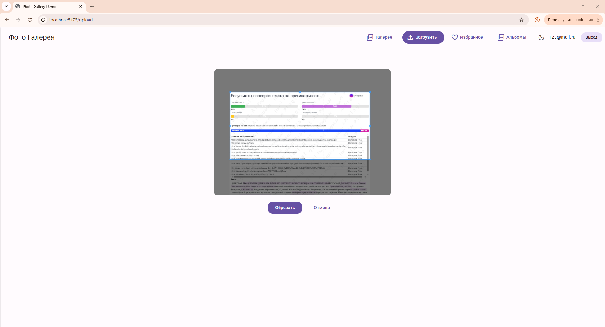

/favorites
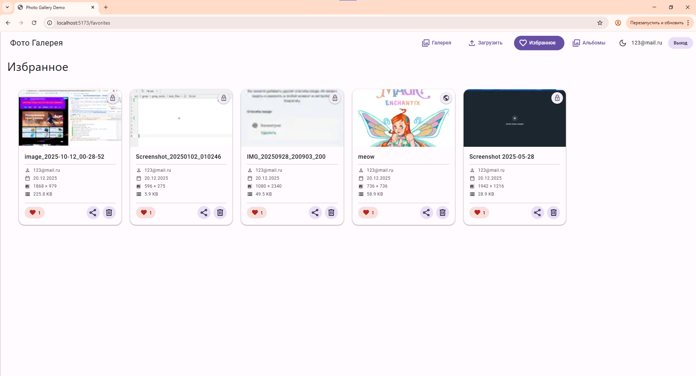

/photo/{id} (если фото открыто не напрямую по ссылке, то будет возможность перелистывать фотокарточки)
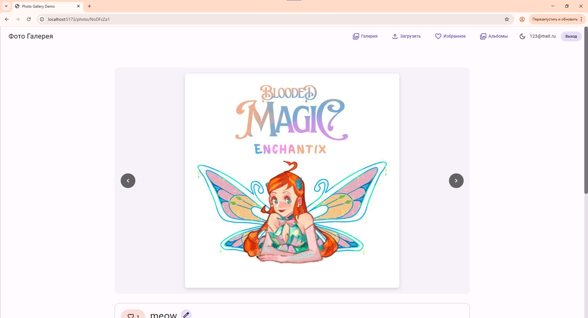
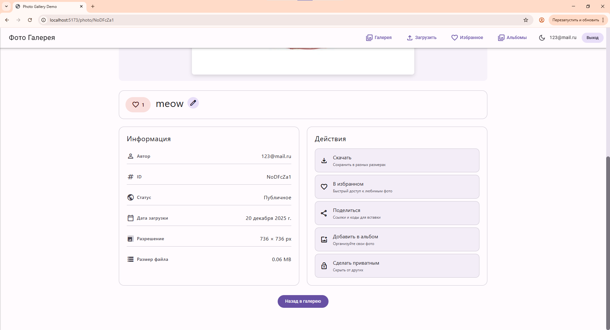

/albums
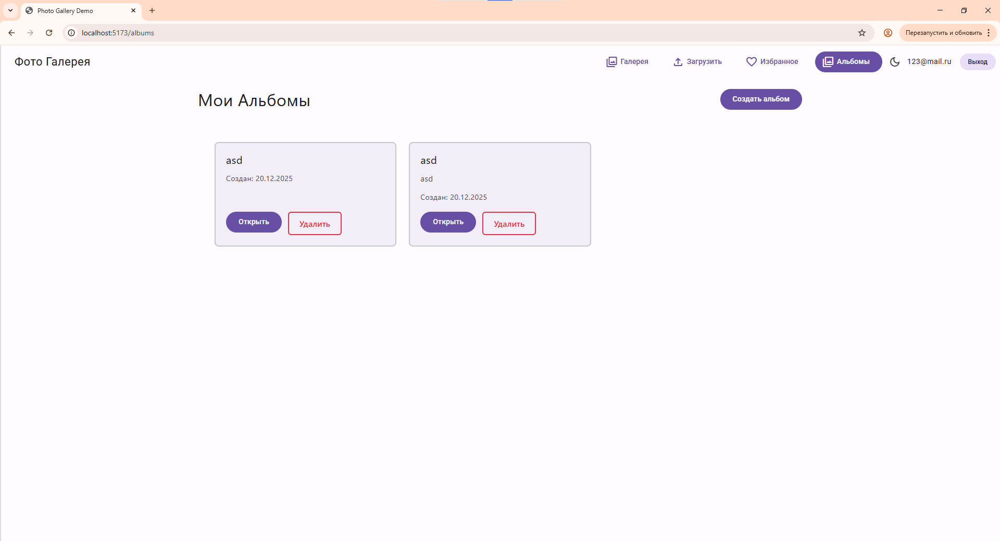

/albums/{id} + модальное окно добавления фотографии в альбом
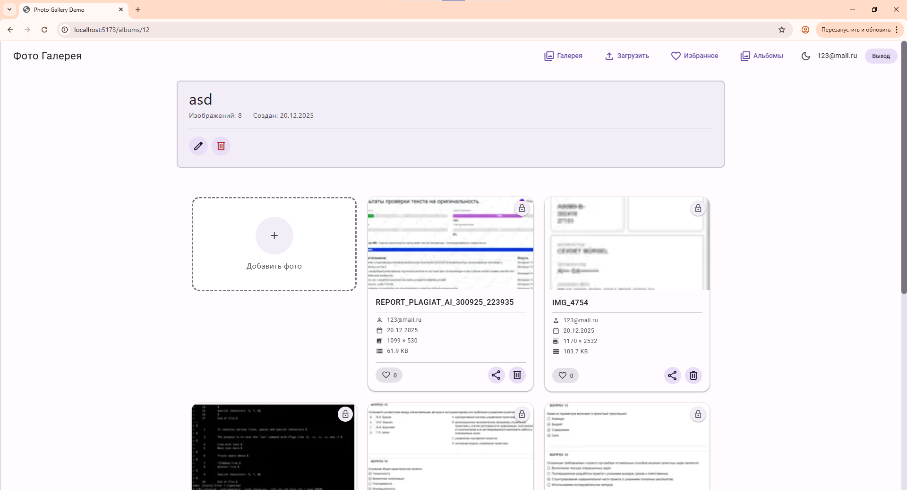
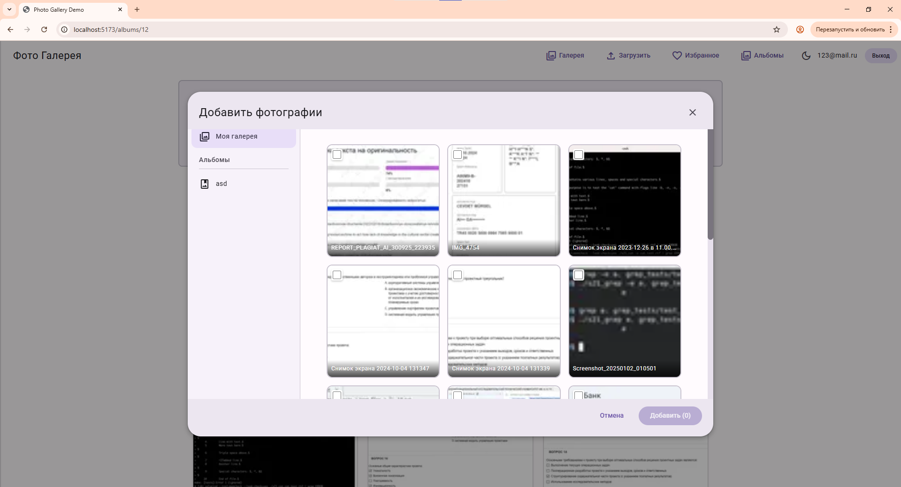

а также есть темная тема и тема повышенной контрастности. Пример темной темы:
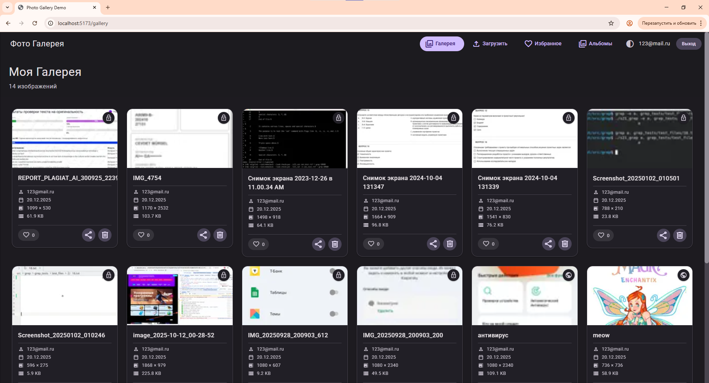